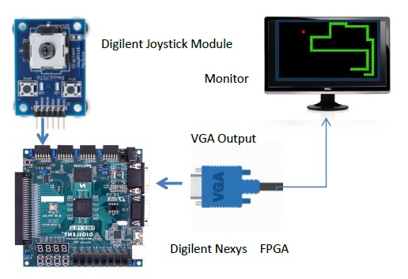
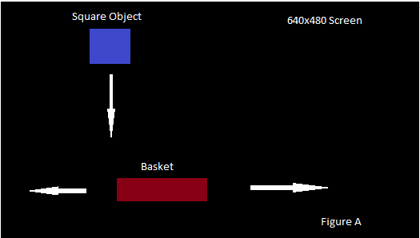

# catch-square-game

A mini catching square game on NEXYS 3 board

In this project, at first we started to create a horizontal and vertical synchronization generator which synchronize the output and the VGA screen. We used the VGA output to generate 640x480 pixels screen resolution and also we  used 7 pins of the VGA controller such as Ground, VCC, R, G, B, Vsync, Hsync. The Vsync and hsynch pins would be the VGA control for the monitor that scans the screen at 25MHz starting from top left corner. Certain pixels are spared for different purposes on the VGA controller and were not visible on monitor. So the algorithm to change colour and but a stationary block on the screen pixel adjustments were made.

### Game

